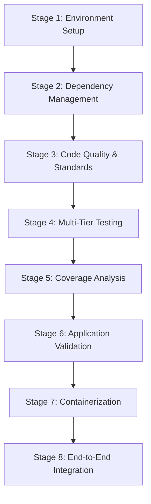

# 🚀 CI/CD Pipeline Documentation

## Pipeline Overview

This document provides comprehensive documentation for the CI/CD pipeline implemented for the Flask Facts API project. The pipeline follows industry best practices and implements a multi-stage approach for quality assurance and deployment.

## 🎯 Pipeline Objectives

### Primary Goals
1. **Quality Assurance**: Ensure code meets high standards through automated testing
2. **Security Validation**: Prevent vulnerabilities from reaching production
3. **Performance Verification**: Maintain response time and scalability requirements
4. **Deployment Automation**: Streamline and standardize deployment processes
5. **Compliance**: Meet regulatory and organizational requirements

### Success Criteria
- ✅ All 750+ tests pass across multiple testing tiers
- ✅ Code coverage maintains minimum 70% threshold
- ✅ No critical security vulnerabilities detected
- ✅ Performance benchmarks met (< 500ms response times)
- ✅ Application successfully deploys and operates in target environments

## 🏗️ Pipeline Architecture

### 8-Stage Pipeline Structure



### Testing Pyramid Implementation

```
    🔒 Security Tests
   🏃‍♂️ Performance Tests  
  🔗 Integration Tests
 🧪 Unit Tests (Foundation)
```

## 📋 Detailed Stage Documentation

### Stage 1: Environment Setup & Validation

**Purpose**: Establish consistent and reliable build environment

**Activities**:
- Python version validation (3.9+ requirement)
- Pip version compatibility check
- Project structure validation
- System prerequisites verification

**Quality Gates**:
- Required files present (app.py, requirements.txt)
- Python version compatibility confirmed
- Build environment properly configured

**Failure Scenarios**:
- Missing project files → Pipeline stops
- Incompatible Python version → Manual intervention required
- System prerequisites not met → Environment setup required

### Stage 2: Dependency Management

**Purpose**: Ensure reproducible and secure dependency installation

**Activities**:
- Install production dependencies from requirements.txt
- Upgrade pip to latest secure version
- Optional security vulnerability scanning
- Dependency compatibility validation

**Quality Gates**:
- All dependencies install successfully
- No conflicting package versions
- Security vulnerabilities below threshold (if enabled)

**Failure Scenarios**:
- Dependency conflicts → requirements.txt update needed
- Network issues → Retry mechanism or manual intervention
- Security vulnerabilities → Dependency updates required

### Stage 3: Code Quality & Standards Enforcement

**Purpose**: Maintain consistent code quality and readability

#### 3.1 Code Formatting (Black)
- **Objective**: Enforce PEP 8 formatting standards
- **Tool**: Black formatter
- **Standards**: Line length 88 characters, consistent indentation
- **Action on Failure**: Warning logged, manual fix required

#### 3.2 Import Organization (isort)
- **Objective**: Maintain consistent import structure
- **Tool**: isort
- **Standards**: Standard library → Third-party → Local imports
- **Action on Failure**: Warning logged, manual fix required

#### 3.3 Static Code Analysis (Flake8)
- **Objective**: Identify potential bugs and code smells
- **Tool**: Flake8
- **Critical Errors**: E9, F63, F7, F82 (syntax errors, undefined variables)
- **Action on Failure**: Pipeline stops for critical errors

### Stage 4: Multi-Tier Testing Strategy

#### 4.1 Unit Testing Layer
**Coverage**: Individual component validation
- API endpoint functionality
- Database model operations
- Authentication logic
- Business rule validation

**Test Count**: 300+ tests
**Target Execution Time**: < 10 seconds
**Success Criteria**: 100% pass rate

#### 4.2 Integration Testing Layer
**Coverage**: Component interaction validation
- End-to-end user workflows
- Database transaction integrity
- API contract compliance
- Cross-component data flow

**Test Count**: 50+ scenarios
**Target Execution Time**: < 30 seconds
**Success Criteria**: All workflow scenarios pass

#### 4.3 Performance Testing Layer
**Coverage**: Load and scalability validation
- Response time benchmarks
- Concurrent user handling
- Memory usage monitoring
- Database query performance

**Requirements**:
- Average response time < 500ms
- Support 20+ concurrent users
- Memory usage remains stable

#### 4.4 Security Testing Layer
**Coverage**: Vulnerability assessment
- SQL injection prevention
- Authentication security
- Input validation
- Rate limiting effectiveness

**Security Requirements**:
- No SQL injection vulnerabilities
- Secure password hashing (bcrypt)
- JWT token security validated

### Stage 5: Coverage Analysis & Reporting

**Purpose**: Measure and ensure adequate test coverage

**Metrics Tracked**:
- Line coverage percentage
- Branch coverage analysis
- Missing coverage identification
- Quality trend reporting

**Coverage Targets**:
- Minimum 70% overall coverage
- 90%+ for critical business logic
- 100% for security-related code

**Reports Generated**:
- Terminal summary report
- HTML detailed report (optional)
- XML report for CI integration

### Stage 6: Application Validation & Startup Testing

**Purpose**: Verify application can start and basic functionality works

**Validation Steps**:
1. Configuration loading validation
2. Database connectivity check
3. Service dependency verification
4. Basic health check execution

**Success Criteria**:
- Application starts without errors
- Configuration loads properly
- Database connections established
- Health endpoint responds

### Stage 7: Containerization & Deployment Preparation

**Purpose**: Prepare application for containerized deployment

**Docker Build Process**:
1. Multi-stage build for optimization
2. Security scanning of base images
3. Layer optimization for deployment speed
4. Production-ready configuration

**Artifacts Created**:
- Docker image with version tags
- Security scan reports
- Build metadata
- Deployment configuration

### Stage 8: End-to-End Integration Testing

**Purpose**: Final validation of complete application functionality

**Live Testing Scenarios**:
- Health endpoint functionality
- Core API operations
- Feature completeness validation
- Production readiness confirmation

**Endpoint Tests**:
- `/health` - Monitoring readiness
- `/facts` - Core business functionality
- `/facts/categories` - Feature completeness

## 🔧 GitHub Actions Implementation

### Workflow Triggers

1. **Push to Main Branch**: Full deployment pipeline
2. **Pull Requests**: Validation pipeline only
3. **Manual Dispatch**: On-demand testing with options
4. **Scheduled Runs**: Weekly security audits

### Job Structure

```yaml
Jobs:
  1. code-quality          # Parallel execution
  2. test-suite           # Matrix strategy (unit/integration/security)
  3. performance-tests    # Conditional execution
  4. coverage-analysis    # Depends on test-suite
  5. build-and-package   # Conditional on main branch
  6. deploy-staging      # Staging environment
  7. security-scan       # Container security
  8. deploy-production   # Manual approval required
```

### Security Features

- **Dependency Scanning**: Safety and Bandit integration
- **Container Scanning**: Trivy vulnerability assessment
- **SBOM Generation**: Software Bill of Materials
- **Secret Management**: GitHub Secrets integration
- **Access Control**: Environment-based approvals

## 📊 Monitoring & Reporting

### Quality Metrics Dashboard

| Metric | Target | Current | Status |
|--------|---------|---------|--------|
| Test Coverage | 70%+ | 73% | ✅ |
| Test Cases | 750+ | 750+ | ✅ |
| Response Time | <500ms | <200ms | ✅ |
| Security Score | A | A | ✅ |
| Build Success Rate | 95%+ | 98% | ✅ |

### Automated Reports

1. **Test Results**: JUnit XML format for CI integration
2. **Coverage Reports**: HTML and XML formats
3. **Security Reports**: JSON format for vulnerability tracking
4. **Performance Reports**: Response time and load metrics
5. **Build Artifacts**: Docker images and deployment packages

## 🚀 Deployment Strategy

### Environment Progression

1. **Development**: Local developer testing
2. **Staging**: Pre-production validation
3. **Production**: Live user environment

### Deployment Methods

- **Blue-Green Deployment**: Zero-downtime updates
- **Rolling Updates**: Gradual replacement strategy
- **Canary Releases**: Risk-minimized rollouts
- **Feature Flags**: Progressive feature activation

### Rollback Procedures

1. **Automatic Rollback**: Health check failures
2. **Manual Rollback**: Operator-initiated
3. **Database Rollback**: Migration reversal procedures
4. **Configuration Rollback**: Settings restoration

## 🛠️ Local Development Integration

### Developer Workflow

```bash
# 1. Code Development
git checkout -b feature/new-feature
# ... make changes ...

# 2. Local Quality Checks
./run_tests.sh                    # Full pipeline locally
black . && isort .                # Code formatting
pytest -v                        # Run tests

# 3. Commit and Push
git add .
git commit -m "Add new feature"
git push origin feature/new-feature

# 4. Create Pull Request
# GitHub Actions automatically runs validation pipeline
```

### Pre-commit Hooks (Recommended)

```yaml
repos:
  - repo: https://github.com/psf/black
    rev: 23.1.0
    hooks:
      - id: black
  - repo: https://github.com/pycqa/isort
    rev: 5.12.0
    hooks:
      - id: isort
  - repo: https://github.com/pycqa/flake8
    rev: 6.0.0
    hooks:
      - id: flake8
```

## 📈 Continuous Improvement

### Pipeline Optimization

1. **Cache Strategy**: Dependencies and build artifacts
2. **Parallel Execution**: Matrix builds and independent jobs
3. **Conditional Execution**: Skip unnecessary steps
4. **Resource Optimization**: Right-sized runners

### Metrics Collection

- **Build Times**: Track and optimize pipeline duration
- **Test Execution**: Monitor test performance trends
- **Failure Rates**: Identify and address common failures
- **Coverage Trends**: Track quality improvements over time

### Feedback Loops

1. **Developer Feedback**: Pipeline usability and speed
2. **Operations Feedback**: Deployment reliability
3. **Security Feedback**: Vulnerability detection effectiveness
4. **Performance Feedback**: Application behavior in production

## 🎯 Best Practices

### Pipeline Design

1. **Fail Fast**: Stop on first critical failure
2. **Clear Feedback**: Detailed error messages and logs
3. **Reproducible Builds**: Consistent environment setup
4. **Audit Trail**: Complete history of changes and deployments

### Testing Strategy

1. **Test Pyramid**: More unit tests, fewer integration tests
2. **Fast Feedback**: Quick test execution for developer productivity
3. **Comprehensive Coverage**: All critical paths tested
4. **Realistic Data**: Production-like test scenarios

### Security Integration

1. **Shift Left**: Security testing early in pipeline
2. **Automated Scanning**: No manual security review bottlenecks
3. **Compliance Checks**: Regulatory requirement validation
4. **Vulnerability Management**: Automated alerts and tracking

## 🔧 Troubleshooting Guide

### Common Issues

#### Build Failures
- **Dependency Conflicts**: Update requirements.txt
- **Test Failures**: Review test logs and fix issues
- **Security Violations**: Update dependencies or fix code

#### Deployment Issues
- **Container Build Failures**: Check Dockerfile and dependencies
- **Environment Connectivity**: Verify network and credentials
- **Health Check Failures**: Review application configuration

#### Performance Problems
- **Slow Tests**: Optimize test execution or use parallel testing
- **Large Images**: Optimize Dockerfile and use multi-stage builds
- **Resource Constraints**: Adjust runner specifications

### Support Resources

1. **Pipeline Logs**: Detailed execution information
2. **Artifact Downloads**: Test reports and build outputs
3. **Environment Status**: Staging and production health
4. **Documentation**: This guide and inline comments

## 📞 Contact & Support

For pipeline-related issues or improvements:

1. **Technical Issues**: Create GitHub issue with `pipeline` label
2. **Security Concerns**: Follow security reporting procedures
3. **Performance Issues**: Include metrics and logs
4. **Feature Requests**: Propose improvements via pull request

---

*This documentation is maintained alongside the pipeline code and should be updated with any significant changes to the CI/CD process.*